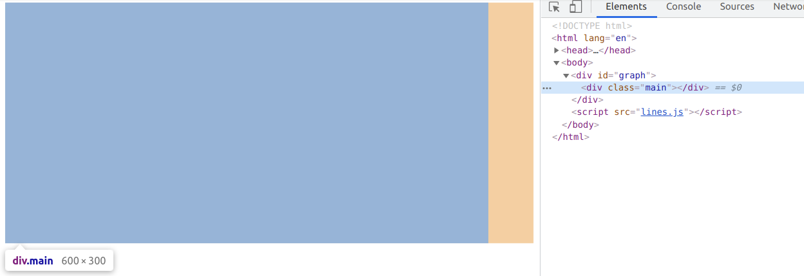
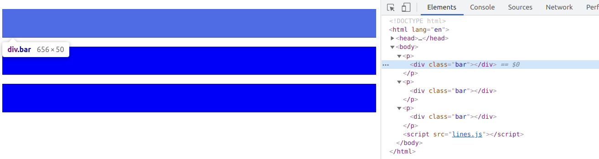
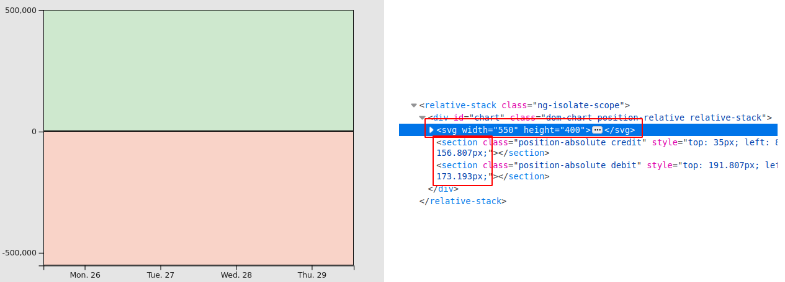

Easy part
---

Easy thing, select the first graph id.

```html

<body>
<div id="graph"></div>
</body>
```

```js
const graph = d3.select("#graph");
```

Easy thing, append a div in this graph.

```js
graph.append('div').attr('class', 'main');
```

```css
.main {
  height: 300px;
  width: 600px;
  background-color: lightgrey;
}
```

So far so good:



### Multi selection

With a selection of multiple `<p>`, you would append a `<div>` to each one

```html

<body>
<p></p>
<p></p>
<p></p>
</body>
```

```js
const graph = d3.selectAll("p")
  .append('div')
  .classed('bar', true); // more sexy than attr('class', 'main') ?
```

```css
.bar {
  height: 50px;
  background-color: blue;
}
```

Still easy :



### classed() and function property

Except this true added to the classed function. By default, the class will not be applied. The real interest of classed
is that the property can be applied depending on a function

```js
const graph = d3.selectAll("p")
  .append('div')
  .classed('bar', () => Math.random() < 0.5 ? true : false);
```

Most property can be evaluated with a function, and obviously we will want graph height that depends on data.

## Access to data values

### selectAll() and enter() magic

`selectAll()` returns an empty selection bound to data.

`enter()` will return a placeholder for working on this selection.

```js
const data = [
  {"country": "China", "population": 1355045511, continent: "Asia"},
  {"country": "India", "population": 1210193422, continent: "Asia"},
  {"country": "USA", "population": 315664478, continent: "America"},
  {"country": "Indonesia", "population": 237641326, continent: "Oceania"},
  {"country": "Brazil", "population": 193946886, continent: "America"}
];
main
  .selectAll("section")  // there is no section yet
  .data(data) // joins data to each element  
  .enter()  // creates one placeholder per data value 
  .append("section")
  .classed('bar', true)
  .style('background-color', () => getRandomColor())
  .style('width', d => (d.population / 2_000_000 + 'px'))  // width depends on data

```

## Scaling is your math friend

x and y function will do all the hard work for you.

You can also have discrete values from the scale

You can have automated padding in the scaling calculation

## stack is not ultimate tool

`d3.stack()` is a kind of groupBy function with cleverness for finding
the right y points of the stack.
Let say you want to group population per continent, and each color would
be a country.
The problem is that USA will not be seen in other continents. `stack()` will
not work.

## Don't learn transform function

There are `d3.group()`, `d3.flatRollup()`, and plenty other functions to manipulate data
in a way D3js love it. Great effort, but today the javascript api is enough to do the work, at worst 
you would pick one or two *lodash* function. No need to learn yet another lib.

Even if you did learn it, then you should probably not use it. Mainly because it will be very hard to be read by someone else two years later
, for example if the data endpoint changed its structure.
 
## call


## HTML or SVG

HTML is responsive but basically makes only blocks and circles.
SVG can drw lines.

I way prefer to manipulate HTML, but lines are cool too.
Also the scale is rendered is SVG.

For the latter, you can mix SVG with HTML, as shown below.
I use a relative and two absolute containers. My data will be rendered in green and red areas.




With SVG, you can't have responsive design, but I don't think you will often need them.

In both case, you can react to javascript events such as `onmouseover` & `onmouseout`, as long as the SVG is filled.

Even if it's not filled, this trick may help

```css
.bar {
  fill: none;
  pointer-events: all;
}
```

Absolute calculation is a real helper, and you need `x()` and `y()` scale functions.
Each time you create a `<g>` element, you have new coordinates.


## navigate

append() and insert are the same result, with details
to navigate 

## Real time data


### enter(), update(), exit()

update()
for real time dynamic data


### The new join() function
