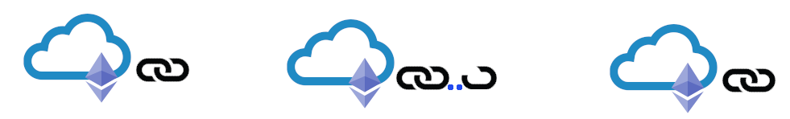
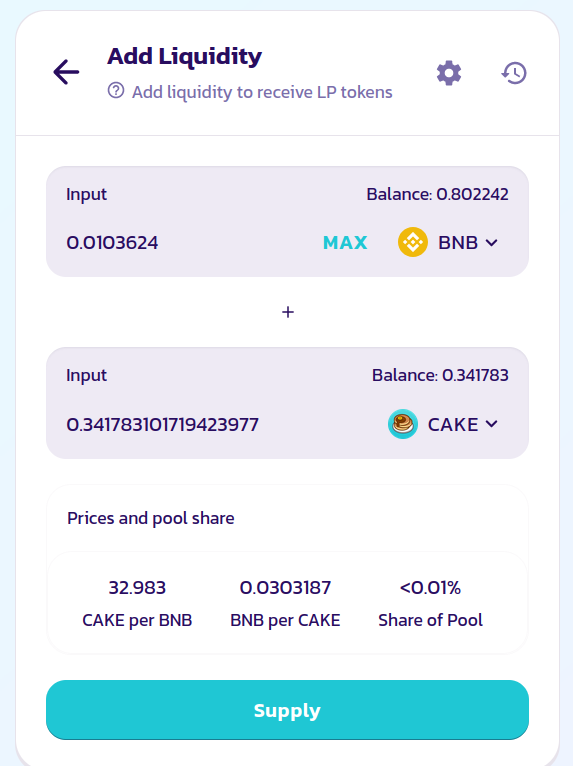
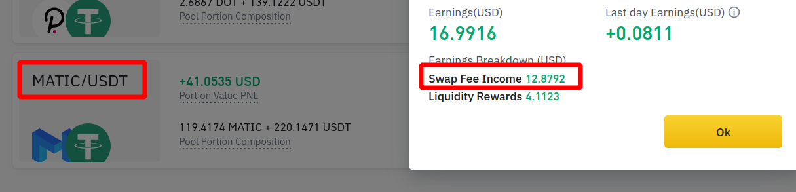
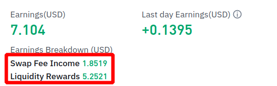
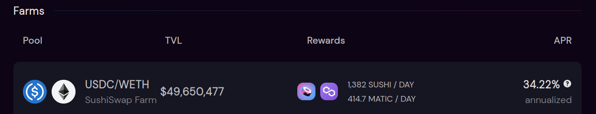
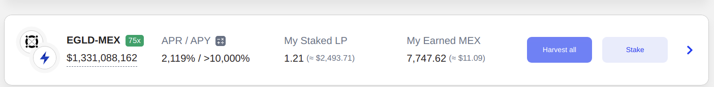
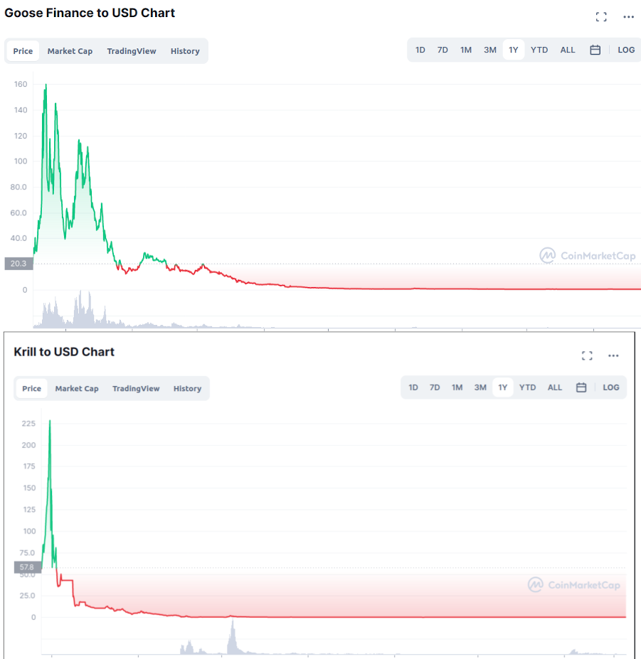
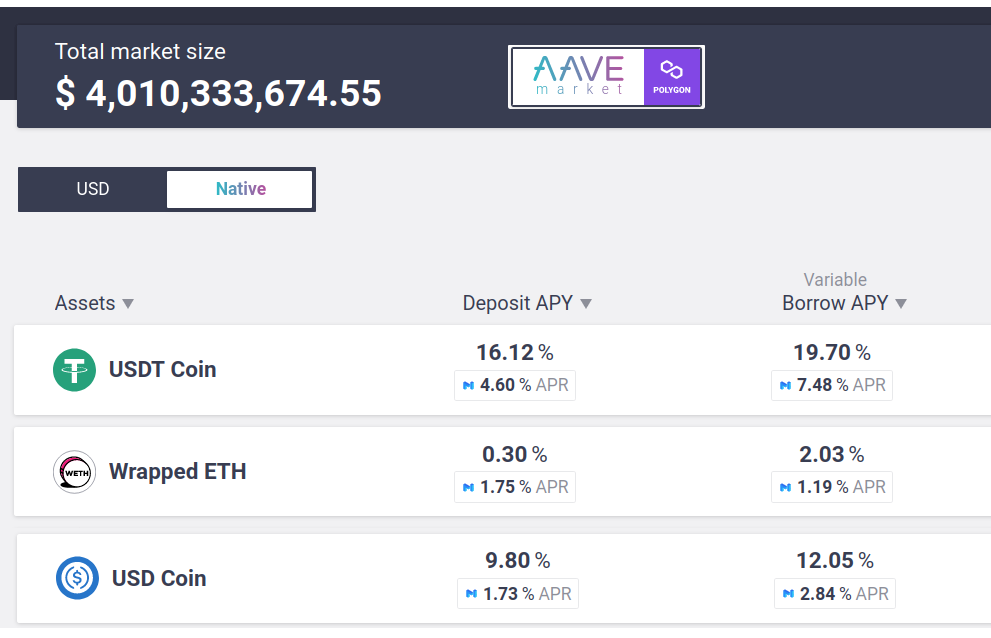
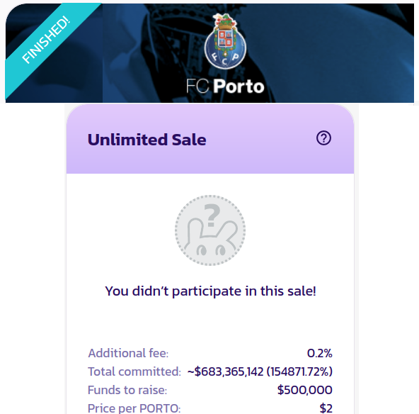

La Blockchain n'est pas qu'un Ponzi. Cet article explique la provenance de l'argent qui abbreuve la DeFi.

---

Cet article propose de l'information, pas des conseils financiers. N'investissez que de la *fun money* : ce que vous pouvez perdre sans soucis !

# Le Yield Farming des cryptocurrencies : d'où vient l'argent magique de la DeFi ?

Le Yield farming - que l'on peut traduire comme agriculture de rendement - est un processus permettant de générer plus d'actifs
en partant d'un portefeuille initial. Ce processus peut utiliser des stratégies très agressives ou plutôt passives.

Pourquoi le nommer *Yield farming* ? Dans mon potager, je peux combiner des plantes, faire une rotation des cultures,
repiquer une plante... ou juste jeter des graines.

Le yield farming propose la même logique, produisant ainsi plus ou moins de revenus. Certaines stratégies sont conçues 
pour augmenter l'espérance de gain, d'autres pour réduire la complexité ou minimiser les risques.

Vous avez tout le champs en expansion de la DeFi (**De**centralized **Fi**nance), qui propose beaucoup d'outils
gratuits pour extraire le maximum de valeur à court ou moyen terme.

Cet article n'est pas un tutoriel qui vous montre comment gagner à tous les coups, ni un dictionaire technique. 
Je vais plutôt montrer que la crypto n'est pas qu'un Ponzi, en appuyant sur la provenance de l'argent. 
Pourquoi certaines personnes vous donneraient de l'argent sans vraiment travailler ?

(Pour cette version française, je garderai après définition l'ensemble du verbiage anglais, puisque c'est ainsi qu'il vous
sera présenté si vous creusez plus loin dans la DeFi)

### Staking pour la sécurité

En détenant 32 ethers et un bon ordinateur, nous pouvons sécuriser le réseau Ethereum 2.0 et en gagner des revenus.
Entre 5% par an (0.05x32 = 1.6 eth) s'il y a beaucoup de validateurs faisant déjà le même travail que vous,
et jusqu'à 20% si ces validateurs venaient à manquer. Le revenu actuel est de 7%, et il ne faut pas espérer gagner beaucoup plus. 
Il est par contre possible - mais pas certain ! - que la conversion en dollar de l'ethereum gagné augmente pendant cette année.

Il est également possible de sécuriser d'autre blockchains ayant un consensus de type Proof of Stake, tel que Fantom, Solana,
Avalanche, Terra, etc. Chacune aura un rendement différent et des exigences de materiel et configuration différentes.
Accrochez-vous pour avoir [une machine Solana](https://docs.solana.com/running-validator/validator-reqs) !

*Staker* est le fait de détenir vos ethers ou d'autres tokens, que vous lockez dans un *Smart contract* pour qu'ils puissent
jouer leur rôle défini dans le code de ce smart contract.

Techniquement, vous transmettez vos tokens à l'adresse de ce smart contract et espérez que le code soit suffisamment bien 
écrit pour pouvoir récupérer ces tokens quand vous le décidez.

Dans le staking d'Ethereum 2.0, la raison pour laquelle vous gagnez de l'argent est simple. Le réseau a besoin d'un ordinateur bien configuré pour créer une chaîne sécurisée pour tous.
Les utilisateurs de la blockchain payent des frais de transaction et des ethers sont créés à chaque nouveau bloc, créant ainsi une légère inflation. Si vous parvenez à sécuriser le réseau, vous gagnez votre part.
Sinon, par exemple en étant déconnecté ou en rangeant les blocs dans le désordre, vous perdez une partie de votre mise.

### Participation à une Liquidity Pool

En finance *traditionnelle*, la liquidité représente la monnaie immédiatement disponible pour être échangée contre un 
bien, un service, une autre monnaie... Elles sont extrêmement importantes : la crise des subprimes s'est transformée en 
crise de liquidités qui a achevé Lehman Brothers en 2008 - événement fondateur du mythe de Bitcoin.
Les banquiers centraux se battent actuellement à qui créera le plus de liquidités.

Dans la DeFi, vous gagnez des revenus en partageant vos liquidités. Avec un token `$A` et un token `$B`, vous créez un 
token nommé `LP A/B` (LP pour *Liquidity Pool*) et fournissez une *Farm* avec ce *LP Token*.
Vous pourrez voir les mots *Pool,* *Vault* ou *Farm* - chaque plateforme a son vocabulaire et ses subtilités.

*Fournir des liquidités pour  LP BNB/Cake dans une Farm PancakeSwap*

Vous pourrez maintenant récolter (*harvest*) dans cette ferme. Soit lors du retrait des LP Tokens, soit en cliquant sur un bouton Harvest.
Cela peut être automatisé dans des *auto-compound farms*, telles que Autofarm.
Cela crée cependant un risque d'une couche de confiance ou de bug supplémentaire.

Il y a ceux qui cliquent, et ceux qui codent. La blockchain est ouverte, est vous pouvez appeler vous-même le web3 avec votre code,
 récupérant ainsi les tokens `$A` et `$B`. Des plateformes no-code permettront sûrement bientôt de contrôler plus finement 
les opérations sans code.

La plateforme centralisée leader Binance reproduit le partage de liquidité en off-chain. Le coeur du système d'échange
de Binance n'est pas bâti sur la blockchain. Ce serait trop lent et trop coûteux. Mais puisque Binance a aussi besoin de liquidités 
pour faire fonctionner ses marchés, les liquidités de leur propres utilisateurs sont les bienvenues.
Contrairement à votre banque, Binance va rémunérer les liquidités de ses usagers.

Dans l'exemple ci-dessus, le *stacker* gagne de l'argent provenant des utilisateurs de Binance faisant la conversion (*swap*) 
des `$MATIC` en `$USDT`, ou de l'`$USDT` vers `$MATIC`. Ces utilisateurs peuvent lui payer 0.2% des frais de transaction, plus 0.1% de frais vers la plateforme.
Ces chiffres ne sont pas du tout standards d'une plateforme à l'autre, mais il est important de noter que 
les *liquidity providers* vont au final souvent gagner plus que la plateforme.
Dans un **D**ecentralized **EX**changes (*DEX*) sur la blockchain comme Uniswap, les utilisateurs vont en plus payer 
des frais de transaction au stackers ETH 2.0.

La seconde partie des revenus sont les récompenses, ou *rewards*. Elles sont de 4.11% dans l'exemple précédent et au final
elles peuvent dépasser les gains des frais de swap. Voici un exemple du couple `AAVE/ETH` sur Binance :

Ces rewards sont souvent payées en token du protocole. Vous êtes récompensés en `$SUSHI` sur SushiSwap, en `$CAKE` sur PancakeSwap...
Cela semble ne pas coûter cher aux propriétaire du protocole, pourtant cela crée une très forte inflation et une fois la hype disparue,
des millions de tokens sans utilité évidente sont distribués.

Les développeurs et investisseurs sont rétribués par ces tokens, et c'est donc dans leur intérêt qu'un marché trouve une utilisation à ce token, et que ce token garde une valeur.
Un moyen habituel de satisfaire tout le monde est de distribuer des *fees* aux propriétaires des tokens.
Si vous swappez du `$DAI` en `$ETH` sur SushiSwap, vous payez 0.2% de fees aux liquidity providers de `LP DAI/ETH` et 0.1% aux stackers de `$SUSHI`. 

Vous pouvez donc d'un côté gagner des fees en stackant `LP DAI/ETH` tout en ayant tous les jours des `$SUSHI` en reward, que vous pourrez stacker pour obtenir plus de fees.
Et tout le monde y trouve son compte... À condition qu'il y ait le moindre intérêt pour l'utilisateur en bout de chaîne à transformer du `$DAI` en `$ETH` !

Il est possible, et c'est un peu le but du jeu, de trouver de meilleures opportunités dans le spectre de la DeFi. Sur le réseau Polygon de SushiSwap, j'ai 
un rendement de 35% annuel pour un `LP USDC/ETH` qui sont probablement deux des trois tokens les plus sûrs avec le `$DAI` (not an advice !).

La blockchain est une base de donnée ouverte en temps réel. Et donc en fonction des fees et des rewards proposés à un instant t,
des quantités ÉNORMES d'actifs peuvent être déplacés d'un protocole à un autre pour gagner quelques pourcents de plus.

Ce n'est pas non plus le succès à tous les coups : un concept complexe d'*Impermanent Loss* vient gâcher la fête. En fournissant vos liquidités, vous donnez vos `$USDC` contre des ethers au moment où les gens veulent moins d'ethers - donc le prix de vos ethers diminue.
Vous êtes toujours du mauvais côté du marché !
Il faut donc entrer au juste prix, espérer du traffic et des oscillations, rester sur un moyen terme.

### Farms aux rendements énormes : l'exemple des Exchanges

Il arrive que des farms aient des rendements gigantesques. La très légitime blockchain [Elrond](https://coinmarketcap.com/currencies/elrond-egld/) propose à travers de 
son nouvel exchange [Maiar](https://maiar.exchange/) des rendements annuels supérieurs à 2000% (APR), et même bien plus en composant tous les jours les gains (APY).

Dans cet exemple, Elrond a apporté plus d'un milliard de dollars aux utilisateurs de **M**aiar **EX**change (MEX).
Le problème est que cette valeur est déclarée en tokens `$MEX`, Elrond n'a pas mis un seul vrai dollar sur la table.

Chaque **heure**, 2493$ investi rapporte 11$ en intérêt, jour et nuit, week-ends inclus. Après un an, le total gagné en `$MEX`
*serait* supérieur à un million de dollars - ce n'est pas un conseil, lisez plus bas !

Malheureusement - ou plutôt, logiquement - plus nombreux sont les `$MEX` délivrés, plus faible est leur valeur. 
Et la valeur des `LP EGLD-MEX` stackés peut décroître bien plus vite que les gains récupérés en `$MEX`. 

La mise initiale d'un milliard de dollar en `$MEX` pourrait valoir une cacahuète un an plus tard. Ce pattern s'est déjà 
vu avec Goose Finance, PolyWhale (token `$KRILL`) et bien d'autres.

S'il n'y a aucun utilisateur pour swapper des actifs sur la plateforme, ces tokens n'ont aucune valeur. Cependant quelques
échanges survivent très bien, tels UniSwap (13 Md $ sur Ethereum), SushiSwap, PancakeSwap, Quickswap (100 M$ sur Polygon)...
Ceux qui ont récupéré les tokens récupèrent également les fees journalières. 

Après avoir distribué gratuitement la majeure partie des tokens de Maiar Exchange, Elrond peut revendre une partie des `$MEX` qui
lui reste avec un profit. Et surtout dans ce cas, Elrond s'offre une communauté richement incitée à démarrer l'écosystème autour de sa blockchain.

### Prêter et emprunter

Emprunter dans le monde de la crypto n'a pas grand chose à voir avec un emprunt dans le monde *réel*. Honnêtement je n'en vois pas trop l'intérêt.

Dans le monde réel, une banque va prêter de l'argent parce qu'ils pensent que vous gagnerez bien plus d'argent. 
Si vous partez avec l'argent prêté, la banque a confiance sur le fait que les policiers vous rendront la vie impossible.

La DeFi est un monde sans confiance - *trustless*. Ce n'est pas que les protocoles ne vous font pas confiance, c'est qu'il n'ont 
aucun *besoin* de vous faire confiance pour faire fonctionner le système.
La raison est que pour emprunter un million de dollars, vous devez déposer, où plutôt *stacker*, deux millions.
Si vous n'arrivez pas à rembourser, le protocole puisera 1.1 million dans votre staking.

À quoi cela peut-il servir alors si vous avez déjà l'argent ? Vous pouvez avoir un effet de levier. Si vous avez deux 
millions de dollars en ether, vous pouvez les mettre de côté tout en empruntant un million pour faire d'autre choses.
Le bénéfice n'est en fait toujours pas évident...

Dans certaines juridictions, réelles ou futures, vous pouvez préférer garder vos tokens pour des raisons fiscales et
par une telle pirouette avoir de nouveaux tokens sans payer la taxe sur la plus-value acquise.
C'est une vue de l'esprit, et je ferai prochainement un article pour expliquer qui détient réellement un actif dans la crypto.

Il y a également un gain de trading immédiat si l'on regarde ce cas sur l'application leader Aave :

Supposons que j'ai 8k$ en `$USDT`, avec l'ether évalué à 4k$. Je dépose 8k$ en `$USDT` et gagne (16.12+4.6) = 20.7 % de gain par an (1656 $).
16.1% proviennent des frais payés par les emprunteurs d'`$USDT`, 4.6% de rewards offerts par le protocole Aave.

Je peux aussitôt emprunter 1 ether. Si je suis vicieux je peux donc les swapper en `$USDT` et déposer encore ces `$USDT`
pour des gains supplémentaires.

Cependant je dois repayer 1 ether avec 2.03 % de frais, tout en récupérant 1.19% en reward😱. Par le jeu des rewards, si 
je prête ce que je viens d'emprunter, je suis largement positif. Nous avons pu justifié auparavant l'intérêt des rewards,
et cela met aussi en lumière la valeur de la blockchain. Il y a si peu d'intermédiaires que le coût du système est très faible.

En bon développeur, j'ai évidemment voulu créer une boucle infinie, mais le système de collatéral ne le permet pas.
Plus embêtant, si le prix d'ether monte rapidement, j'aurai une somme plus grande à rembourser avant d'être débordé et donc *liquidé*.

Si je suis un robot ou un smart contract, c'est ok, je peux réagir instantanément si le code l'a prévu. 
En fait la plupart des transactions d'Aave sont exécutées par des smart contracts détenus par d'autres protocoles. 
Bien que je ne sois pas personnellement motivé pour prêter/emprunter, le fait que les robots soient les principaux clients
montre qu'il y a un intérêt pour un tel service.

Évidemment le market cap d'un protocole ne peut pas se mesurer de la même façon qu'une capitalisation boursière. 
On peut tout de même noter que Aave est évalué à 5Md$ en étant largement leader sur ce domaine. 
Comparativement, Bank of America vaut 385Md$ et la Société Générale environ 30Md$. 

### Initial Farm Offering

L'Initial Farm Offering, ou **IFO**, est une façon pour les fondateurs d'une compagnie de vendre rapidement et publiquement
leurs parts. C'est comme une introduction en bourse (IPO) sous stéroides, à un stade très précoce. 
Le processus exact de l'IFO va dépendre de chaque plateforme.

Supposons que les fondateurs d'ACME Inc. mettent leur tokens `$ACME` dans une farm, et que les utilisateurs y investissent des ethers.
A la fin de l'IFO, le prix initial du token `$ACME` sera déterminé par le nombre d'ethers déposés. Les fondateurs récupèrent les ethers, 
pour s'enrichir mais aussi continuer le développement et le marketing. Les utilisateurs récupèrent des tokens contre ces ethers. 
Certains le vendront immédiatement, d'autres prévoient une valeur future plus grande, et les enthousiastes espéreront 
une vrai utilité à ce token si les développements arrivent à terme.

Le but des fondateurs est aussi de répandre le token à un public plus large que les investisseurs de startups. 
Plus bruyante est l'IFO, plus nombreux seront ceux qui verront une utilité au token et pourront déterminer son prix.

Prenons l'exemple de l'[IFO actuelle du club de football FC Porto](https://pancakeswap.finance/ifo), sur PancakeSwap.

C'est une autre mécanique : 250,000 token `$PORTO` seront vendus au prix fixe de 2$ pour un total de 500k$.
Un demi-milliard est déjà levé par la foule,
donc tout ce monde n'aura pas le nombre de tokens désirés. Certains d'entre eux essayeront d'en acquérir sur le second marché,
peut-être pour plus que 2$.

Pour une personne normale, il est virtuellement impossible d'investir dans le prochain batch de startup du Y Combinator,
la crème des startups incubées. Vous pouvez assez facilement investir dans d'autres start-up via un club mais le ticket d'entrée est
en général autour de 10k$.

Avec le farming, et plus encore l'IFO, n'importe qui avec Internet peut investir très tôt dans une startup blockchain pour quelques dollars.

### Composition et conclusion

Nous avons décrit ici des moyens de gagner de l'argent virtuel. Cela requiert des connaissances techniques et il y a beaucoup 
de façons de perdre de l'argent : mauvais choix, arnaque, bug dans un smart contract ou simplement perte des clés.

Vous pouvez aussi être cupide (c'est ici une vertu !) et essayer de gagner un peu plus, en empruntant autant que possible,
prenant les rewards, puis les déposant dans un Liquidity Pool. Rembourser le prêt, prendre les profits, recommencer. 
Automatiser, puis écrire un smart contract pour le faire.

Ou plus simplement staker sur [Yearn Finance](https://yearn.finance/#/vaults) qui a déjà codé pour vous des systèmes similaires.

Quoiqu'il en soit, demandez-vous toujours : quel est l'intérêt du token ? Pourquoi des personnes m'en donneraient plus ?