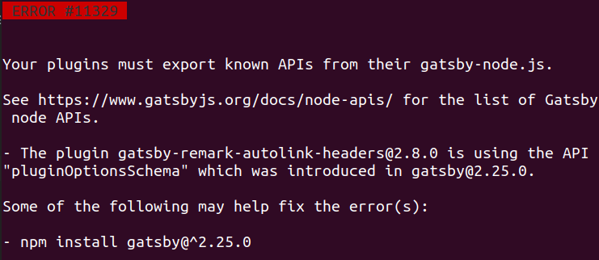
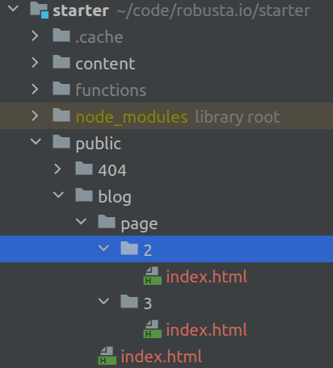
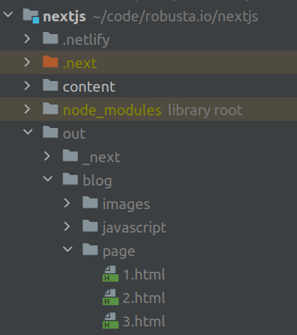

Le bug de trop de Gatsby et ses plugins, un mois plus tard, je migre ce site en NextJS... Si aujourd'hui chaque codeur semble préférer NextJs à Gatsby, le choix n'est 
rétrospectivement pas si évident.

---

Gatsby et ses plugins
----

Je veux maintenant écrire bien plus de contenu à haute valeur sur ce site,
et j'étais donc décidé à améliorer deux-trois éléments, quand apparu à mon premier `gatsby develop` :

...le bug de trop. Non pas sur mon code, mais un bug qui parle de plugin
et de mauvaise version de l'une de ses dépendances.

Gatsby ou NextJS ?
-----

Le site que vous lisez actuellement vient de migrer de Gatsby vers NextJS.
Ces deux technologies embrassant la *JAM Stack* sont des *Static site generators*, ce qui permet 
d'afficher très rapidement des pages web, avec un maximum de sécurité. L'opposé de Wordpress.

Mais est-ce que cela permet de coder rapidement ?

DX: Experience de développement
---

Cette capacité à faire progresser rapidement et sympathiquement une application a son petit anglicisme
barbare : la *Developer Experience*, aka DX. Maintenant que les développeurs sont plus précieux
 que les utilisateurs, la DX a son importance.
 
La DX joue sur la rapidité de développement, mais aussi sur le 
plaisir à coder, ce qui est en fait essentiel pour un projet non monétisé comme celui-là.

Et pour moi comme beaucoup d'autre, Gatsby et GraphQL sont catastrophiques. Chaque type de page
se retrouve affublée d'une requête GraphQL plus ou moins longue et qui se ressemblent.
 
 
 
Non seulement, c'est peu lisible, mais en plus l'outillage associé n'est pas excellent.

De plus il faut enchaîner plugins sur plugins. Et donc l'utilisation d'une bibliothèque adaptée à Gatsby et 
,problème parfois superposé, requêtable en GraphQL. Le problème qui m'est survenu était qu'un de ces plugin n'était pas mis
à jour assez vite. Classique et prévisible.

Langage de programmation
---

Les deux technologies utilisent React JS, mais il suffit d'un argument simple pour initialiser NextJS avec Typescript. 
Avec un peu d'habitude, Typescript est un must pour la plupart des dévelopeurs.

Typescript est toutefois utilisable avec Gatsby. J'ai utilisé
un [starter kit non officiel](https://github.com/antoinerousseau/gatsby-starter-antoine/) proposé
par [Antoine Rousseau](https://antoine.rousseau.im) pour Gatsby.

Framework CSS
---

NextJS propose les *CSS Modules* par défaut. Rien n'est proposé par Gatsby, ce qui n'est pas plus mal. 
Les deux frameworks fonctionnent bien avec *Sass*.
 
J'avais utilisé facilement les *Styled Components* avec Gatsby, et ce serait aussi simple à mettre en place avec NextJS.
 En comparaison, les CSS Modules ne m'ont rien apporté, c'est vraiment une question de goût et d'expérience. 

Simplicité de déploiement
---

Vercel, que l'on peut classer comme un concurrent de Heroku, est l'éditeur de NextJS.
 La documentation propose donc logiquement de déployer en quelques instants
  le site sur les serveurs de Vercel.
  
Mais d'une part le pricing de Vercel n'est pas clair, d'autre part je pense qu'il n'est pas bon de trop se nouer avec un éditeur.
 Si le code se verouille doucement, je serai plus alerte pour sortir de Next JS en étant hors du cocon de Vercel.

### Build étrange pour Next JS

Il me faut 10 secondes pour builder NextJS, où Gatsby prend 16 secondes. Ce n'est pas représentatif vu la petite taille du site.

En théorie, ces deux build doivent créer un site avec du html basique. Or les structures sont différentes. Voici celle générée par
Gatsby

Pour Gatsby, il faut se rendre sur `/page/2/` pour qu'un serveur très standard va charger le fichier `/page/2/index.html`

La génération est différente pour Next JS :

Si bien qu'après avoir fait la commande `next build && next export`, j'ai deployé le site avec un serveur local 
(`php -S localhost:8888`), et
 si l'on se rend immédiatement à la seconde page `/page/2`, nous avons un affreux 404. Il faudrait charger
`/page/2.html`, ce qui n'est pas une url *sexy*.

Si je passe par le homepage, puis navigue vers la 2e page,
  je n'ai pas de problème car l'application affiche le contenu issu d'un Json chargé via Ajax.

Peut-être un problème de configuration, mais c'est inquiétant si ce n'est pas le cas. 
Le déploiement sous Netlify se fait pourtant sans soucis et le probleme de 404 n'est pas rencontré. 

Publication du site
----

Le changement des DNS s'est fait rapidement. La roadmap est écrite et les prochains objectifs sont :

- La page pour presenter les formations
- SEO : quelques headers et le sitemap
- Une api pour enregister les emails d'une newsletter

Le point du **sitemap** est intéressant pour la comparaison entre Gatsby ou NextJS. Il s'agit de transformer l'ensemble des pages 
et articles pour générer un XML. En utilisant Gatsby, il faudrait partir de je ne sais quel plugin ou requête graphQL.
 
Avec NextJS j'ai déjà accès un tableau d'objet de type `Post` représentant les pages qu'il faudra mapper vers du XML.
  Ce n'est pas fait, mais j'ai une vision claire de par où commencer.
  
En conclusion, il manque à Gatsby de proposer une version officielle avec typescript et sans graphQl pour rivaliser.

Depuis la migration, le site est tout aussi rapide, les mises à jour sont plus régulières, les articles plus fréquents,
 ce qui était bien le but recherché.
 
