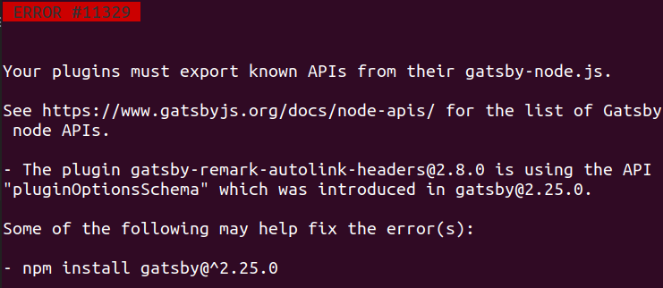
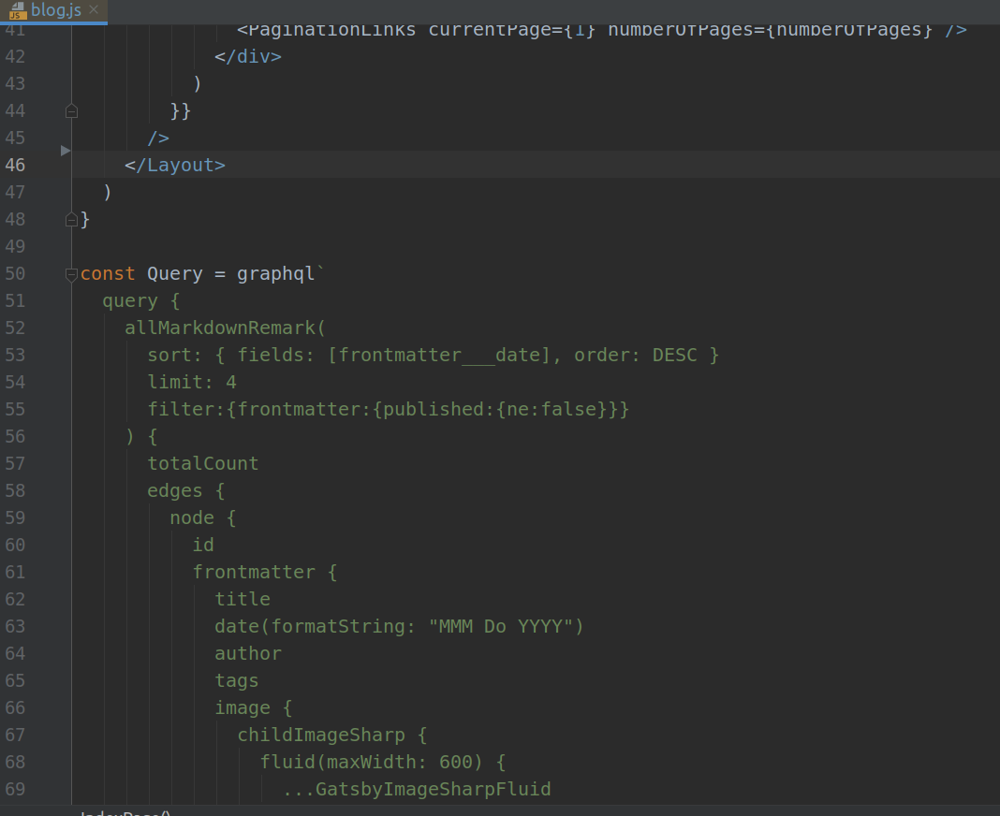
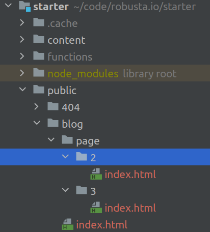
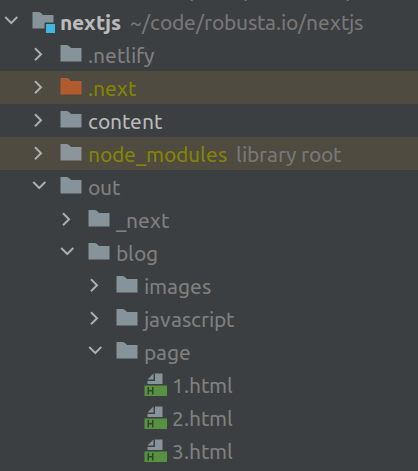
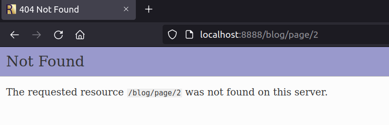

This site just migrated from Gatsby to NextJS. If every coder today leans toward NextJs versus Gatsby, now I don't feel this so obvious.
 
---

Gatsby and its plugins
----

I want to write more premium content on this site, so I was motivated to upgrade a few items, 
when appeared at my first `gatsby develop` :

...last bug I wanted to see. Not on my code, but a bug about a plugin and the wrong version of
one of its dependencies.

Gatsby versus NextJS ?
-----

The site you are reading now just migrated from Gatsby toward NextJS.
Those two technologies embrace the JAM stack and are *static sites generators*, which allow
to display very fastly web pages with a maximum of security. Wordpress killers.

But does it allow fast improvements ? 

DX: Developer Experience
---

This capability of improving fastly and nicely an application is named *Developer Experience*. Now
that developers are more valuated than users, it has its importance.

DX relies on development speed, but even more on the pleasure of coding. This is impacted by many
 factors that won't be described there, but you can understand that pleasure is important for 
such a not monetized web site. 

And, in terms of pleasure, Gatsby and and GraphQL are terrible. My opinion, and opinions of many.
Every type of page is affected by a huge, unpleasant, partly copy/pasted GraphQL query. 

 
 
 
That is not very readable, and moreover the tooling is far from excellent.

Even worst, you must add many plugins, where each plugin wrap a lib adapted to Gatsby structure and GraphQL
queries. The bug I had above appeared on one of this plugin, not updated quickly enough. Classic and predictable.

Programming language
---

Both Gatsby and NextJS use React JS, but only one command line argument quickly adds Typescript to NextJS.
Typescript is now a must for most developers.

You can still use typescript with Gatsby. I used an [unofficial starter kit](https://github.com/antoinerousseau/gatsby-starter-antoine/)
 proposed by [Antoine Rousseau](https://antoine.rousseau.im) for Gatsby. 

CSS Framework
---

NextJS proposes by default *CSS Modules*. Nothing is proposed by Gatsby, which is not that bad.
 Both work well with *Sass*. 

I used very easily *Styled Components* with Gatsby, and it would be that easy also with NextJS.
CSS Modules didn't bring me more, it's a question of taste and coder experience.
 

Deployment ease
---

*Vercel*, which is an Heroku competitor, is the NextJS editor and proposes in its documentation
a path to deploy in a few steps the website on Vercel servers.
 
The JAM stack also contains api capabilities. Your website is not read-only, and can create actions.
Vercel proposes an api from React JS front to Vercel servers.   

However pricing from Vercel is not obvious to catch. Also I don't think it's always a good idea to be tied
to an editor. If the code gets slowly locked, I would have more awareness on quitting NextJS being outside
Vercel cocoon. I needed around 20 hours to move from Gatsby to NextJS, so I may reverse it quickly as long
 as I don't call too much proprietary Vercel apis.       

 
### Strange build for NextJS

It took 10 seconds to my new edge computer to build NextJS website, and 16 seconds with Gatsby. As this 
site is very small, those are not representative figures. 

I expected both technologies to create basic html. It happens that structures were different. Here is the one generated by Gatsby.

A browser going to `/page/2/` will load `/page/2/index.html` file with a basic server.

Generation is significantly different with NextJS:

So after the command `next build && next export`, I deployed the site with a local server (`php -S localhost:8888`), and going directly 
to the second page (`/page/2`), we have an awful 404 error. I should call `/page/2.html` which is not a *sexy url*.

If I first go to the homepage, then on the second page, it will work as the React application will display content loaded from 
some Json.

Thought I followed the documentation with nothing fancy, it may be a configuration problem, but it's worrying if it's not the case. 

Nevertheless, like my old Gatsby site, I used Netlify who deployed everything without any problem,
nor any 404 error page. 

Site publication
----

The change of DNS was done quickly. The roadmap is written and next items are:

- The page to present the trainings
- SEO: some headers and the sitemap
- An API to record the emails of a newsletter

The point of the **sitemap** is interesting for the comparison between Gatsby versus NextJS. It is about transforming all the pages
and articles to generate an XML. Using Gatsby, you would have to start from some sort of plugin or graphQL query.

With NextJS, I already have access to a `Post` type object array representing the pages that will need to be mapped to XML.
It's not done, but I have a clear idea of where to start.

In conclusion, Gatsby is missing an official version with typescript and without GraphQL to compete.

Since the migration, the site is just as fast, the updates are more regular, the articles more frequents,
which was the desired goal.
