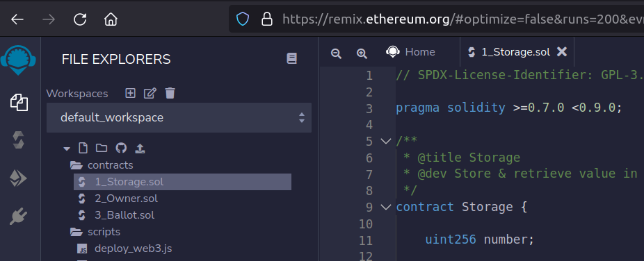
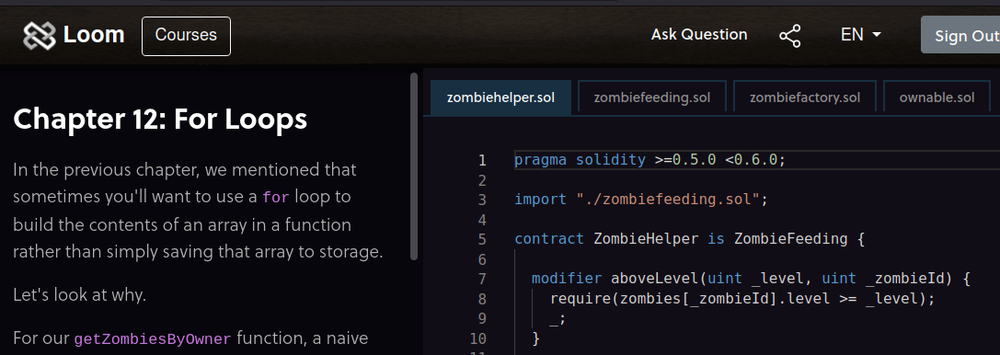

Setup as quick as possible your professional environment for learning web3 coding.

-----


This article will explain to developers how to setup a local environment for coding, testing and deploying
some Ethereum-like blockchains. I will explain different parts and give you valuable web resources.

TL;DR; Watch this [Truffle beginners](https://www.youtube.com/watch?v=62f757RVEvU) video
from EatTheBlocks.

Where to start 
----

You can very quickly start using [Remix IDE](https://remix.ethereum.org). It's an online webtool. I have been able to deploy 
[my first token (RBTA)](https://bscscan.com/address/0x5eA1866F3b2c5EA4baBE9C5DB2F920CB9968560E)
with it. It's yet another shitcoin, but you can buy some to tip me 😊

To deploy the RBTA token, I used this tutorial [by Ivan on Tech](https://www.youtube.com/watch?v=h4gQD7R1r94&t=298s)



You can also learn solidity and web3js with Cryptozombies. It's quite deep by the way, but there is no 
creativity as you must exactly type the correct line.




Use a local IDE
----

Remix is fun for one day, but you want your files with solid tooling. You will code some Solidity but also some 
React or Vue for the web, and you probably want to keep your beloved tooling.

As I'm a Jetbrains fan, I added the Solidity plugin backed by Jetbrains. It brought some bugs, so I had to remove it then reinstall it. It's 
quite unsual...but it happened


Use truffle
-----

Truffle is a tooling framework. You have a set of preconfigured tools, but you don't
add their code.

Install it using `yard add truffle`. If you are good with npm tooling, I would avoid installing it globally, so that
you control exactly which the version. In that case you would type `node_modules/.bin/truffle` instead of just truffle, but there are tips.

You will be able to :

- compile your code and create contracts : `truffle compile`
- make automated tests of your contracts : `truffle test`
- deploy the contracts :
    * `truffle develop` will start the chain and open a console
    * `truffle migrate --reset` will redeploy all contracts

[EatTheBlocks](https://eattheblocks.com/) team makes great contents on Solidity coding. Here is the one
for [Truffle beginners](https://www.youtube.com/watch?v=62f757RVEvU). This video is mandatory !


Use ganache
----

Ganache is a tool that allows you to run a ethereum blockchain with plenty of options. Truffle is using Ganache behind 
the scene, but it's useful to be able to manage it yourself. We are coders, so we will use the CLI version 😁.

Install it with `yarn add ganache-cli`. Like with truffle, avoid installing it globally.

-  `ganache-cli`: start a brand new blockchain
-  `ganache-cli -db "./db-path" -m "bread car ... color"` : start a persisting blockchain with defined account

Here is the [EatTheBlocks Ganache video](https://www.youtube.com/watch?v=AS2_uPSTk5E).


Test and mocks
-----

It's quite easy to test a Solidity contract. There is one major problem though. You often want to **inject an
address** - the oracle address in my case - and only the contract owner should do this. But while coding, you don't know the 
owner address yet.

The idea is to make a mock contract. I code in a MockCodeFan.sol file that is the copy of the final `CodeFan.sol`, but
adding these lines at the end :

```solidity
contract MockCodeFan {

    // might be constant
    address  private  OWNER = 0xf17f52151EbEF6C7334FAD080c5704D77216b732;
    address  private  ORACLE = 0xf17f52151EbEF6C7334FAD080c5704D77216b732;
    
    function setOracle(address oracle) public{
      require(msg.sender == OWNER);
      ORACLE = oracle;
    }
    // ....
    /**
    * TESTABLE FUNCTIONS and events - Should be deleted in deployment
    */
    function setOwner(address owner) public{
        OWNER = owner;
    }

    event Debug(address  _from, string  domain);

}
```

So in the test I can start with 

```js

  let [johndoe, nik, oracle  ] = accounts;
  await contract.setOwner(nik);
  await contract.setOracle(oracle, {from: nik});

```


Debug
-----

Now that you have Solidity code, you want to understand what's going on before sending millions into the contract. But there
is no `console.log()` or debugger attachable in Solidity 🤷. You don't easily know what's
going on in the machine.

The technique is to create a Debug event and listen to it while testing.

```solidity
    event Debug(address  _from, string  domain);

    function addSite(address  user, string calldata domain) external {
        emit Debug(user, domain);
        require(msg.sender == ORACLE);
        // ...
    }
```

To simplify things, I used [truffle-assertions](https://github.com/rkalis/truffle-assertions)  library :

```js
const truffleAssert = require('truffle-assertions');
result = await contract.addSite(oracle, domainNames[0],
    {from: oracle});
// -> will display the event
truffleAssert.prettyPrintEmittedEvents(result); 
```

Next step
----

I used **Remix** to deploy my first token, **Truffle** for my first real projects. And I will probably try [Hardhat](https://hardhat.org/) soon.

The main reason is that you can use `console.log()` directly in the solidity code (wow 😁) and 0xGorilla created
[Smock](https://github.com/defi-wonderland/smock), a mock plugin for Hardhat. That proves Hardhat can be much more flexible than 
Truffle. But as it gives a lot of options and plugins before starting, I would not start directly with it.


