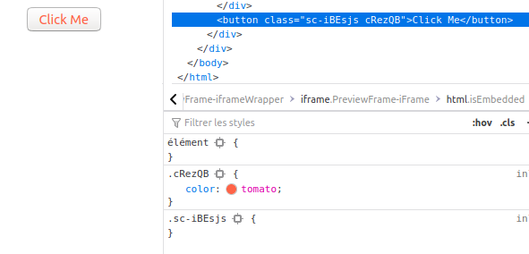
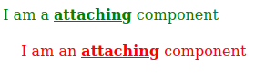

Styled component is a technology that scales css. It's great, but there are some 
traps. Here is what I wished I knew the most when starting Styled Components.

---

## Goals and Difficulties


**Styled Component** is a library coded by the impressive Max Stoiber and now
 maintained by many others, proof of success and durability.
 
There are two main goals in my point of vue.

- Scale by avoiding hell of BEM, like using class name such as `search-box__btn search
-box__btn_max_visible` 
- Protect your component from the cascading pattern of CSS. Yes. Break the <b>C</b> of CSS


Like you may expect, this second goal may bring some pain, or at least surprises when, like me
, your are too naive.
 
 
### Quick example


Let starts with an example [from the doc](https://styled-components.com/docs/basics#extending): 

```jsx
const Button = styled.button`
  color: palevioletred;
`;

const TomatoButton = styled(Button)`
  color: tomato;
`;
```

That works and gives two nice buttons. But using:

```jsx
const MyButton = ()=><button>Click Me</button>

const MyTomatoButton = styled(MyButton)`
  color: tomato;
`;
```

I'm naive and I have a button. I want to style it, so I write `styled(button)`.
But my new button won't have any tomato color 😞 

### Read the manual

First, be smarter than me and don't miss this most important line [from the manual]( 
https://styled-components.com/docs/basics#styling-any-component):

> The styled method works perfectly on all of your own or any third-party component, **as
> long as they attach the passed className** prop to a DOM element.

```jsx
const Link = ({ className, children }) => (
  <a className={className}>
    {children}
  </a>
);
```

 
Why ? Because later the examples given across the web, including Styled Component 
documentation gives examples where it looks easy to modify a component, when 
this second goal is <b>exactly</b> to avoid any modification of a component.


## Applying classes

The problem is that styled(Comp) is effective only if Comp is already a styled component.
To achieve this, you must add the `className` to MyButton


```jsx
const MyStyledButton = ({className})=><button className={className}>Click Me</button>

const MyTomatoButton = styled(MyStyledButton)`
  color: tomato;
`;
```

Now StyleComponent will create some classes and apply them to your component, making it a styled
 component.
 

 
*No className, no style*. When using `styled.div`, then StyledComponent has 
already applied the `className` trick. 

This is wanted behaviour. You are not supposed to transform a component except
if the component creator has explicitly said you can ! It's the 
[open/close principal](https://en.wikipedia.org/wiki/Open%E2%80%93closed_principle)
applied to styling.

## Advanced usage


### Restyle

Once a component is styled, you can re-style it.

```jsx
const AttachingComp = ({className})=><div className={className}>I am a <strong>attaching</strong> component</div>

const GreenAttachingComp= styled(AttachingComp)`
  color:green;
  strong{
    text-decoration:underline
  }
`

const Child = styled(GreenAttachingComp)`
   margin: 20px 20px;
   color: red;
`

```



### Nesting components

The same *closed by default* behaviour is applied to nesting components. If you 
have not applied `className` to a React element, nesting rules are ...not applied.

```jsx

const BasicComp = () => <div>I am a <strong>basic </strong>component</div>;

const AttachedComp = ({ className }) => (
  <div className={className}>
    I am an <strong>attached</strong> component
  </div>
);

const StyledBasicComp = styled(BasicComp)``;
const StyledAttachedComp = styled(AttachedComp)``;


const DemoNesting = ({className})=>{
  return (
    <div className={className}>
      <StyledBasicComp/>
      <StyledAttachedComp/>
    </div>
)}


export const StyledDemoNesting = styled(DemoNesting)`
// general css rules. Will be applied to all nodes below
font-size:12px;
strong{
  color:red;
}


// component rule on basic component. Won't be effective
${StyledBasicComp}{
  color:yellow;
}

// component rule on className attached component. Rule is effective
${StyledAttachedComp}{
  color:green;
  font-size:24px;
}
`
```

You can test it in this [Stackblitz](https://stackblitz.com/edit/styled-components-robusta?file=nesting.js) 

 
## When should I attach className ?

Most often, you should not. Because it's designed this way. If you have a few rules, you should
 prefer standard css or sass.
   
If you have a bigger application, then attaching `className` could increase interferences.

If you want to present a component in different way, you will rather use a [theme](https://styled-components.com/docs/advanced#theming)
 or [passed props](https://styled-components.com/docs/basics#passed-props) if it's through your application state:
 
Attaching `className` is really meant for the case where you create a third party library, and you
 design a point of extension. You create some open explicitly for the style. Attaching the
  `className` will avoid some hacks are they are described here [in this issue](https://github.com/styled-components/styled-components/issues/2076)
  
I kind of attach `className` for creating my own library. I design some Theme Component, such as
 `TCard`, then I modify the spacing at different point of this Gatsby website, or reuse it for similar
  websites. 

For the moment, it's just a test, and it looks good. But it took me way too much time to really
 understand how and why attach `className`. Maybe this article will help you 😊 


