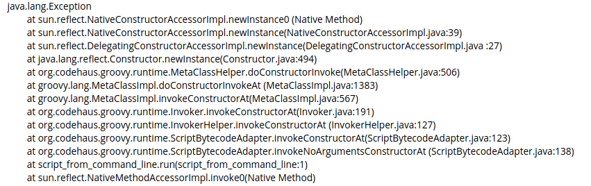
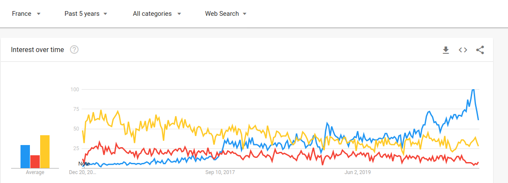

Vous avez travaillé quelques années avec un langage principal que vous maîtrisez correctement. Quel serait le suivant, et pourquoi ? 

---

# Objectifs

Les objectifs pour apprendre un nouveau langage sont nombreux:

- S'ouvrir des portes sur le marché du travail
- Apprendre des nouveaux concepts pour se perfectionner
- Réaliser une application utile: la bonne techno pour le bon outil
- Se faire plaisir

Cet article sera plus orienté sur les deux premiers points. C'est de toute façon difficile de savoir quelle est la techno qu'il vous faut ou ce qui vous amuse. Mais gardez ces deux derniers points en tête lorsque vous continuerez votre lecture : on ne  devient bon que dans ce que l'on aime.

Les langages ne sont pas classés par pertinence, mais rangé par plateforme puis ordonné par mon niveau de compétence. Par conséquent, ne tenez pas trop compte du dernier paragraphe 😅


# Tour d'horizon

## La Java Virtual Machine

La **JVM** est le moteur de Java et d'autre langages. C'est interessant de pouvoir travailler dessus car elle est excellente pour :

* La vitesse: la JVM est super méga rapide
* Le taux d'utilisation
* Les outils pour analyser les performances de la production

Je déteste la "prod", et je n'y connais rien. Mais si je dois m'en occuper un jour, je serai rassuré d'être sur la JVM.

La JVM supporte plusieurs langages. Java évidemment, mais aussi Kotlin, Groovy, Scala ou des implémentations d'autres langages tels que Jython (Python), Clojure(Lisp), JRuby (Ruby), etc...  

Le défaut de la JVM est que beaucoup de sa vitesse vient d'un trade-off sur l'utilisation assez massive de mémoire et une lenteur au demarrage. Dans un monde de conteneurs Docker, c'est assez problématique. Graal VM est une VM Java annulant le coût de la VM, mais réduisant les possiblités d'introspection, des annotations... et l'outillage existant permettant d'analyser les performances ne fonctionne plus.

### Java

**Java** est le langage objet le plus utilisé. C'est aussi le langage par défaut de la JVM, et il a donc toutes les qualités associées.

Par rapport aux autres langages, Java a le plus d'outils et une meilleure lecture des stacktrace. Un bug n'est pas toujours bienvenu. Avec une stacktrace contenant surtout des méta-informations générées par Groovy, c'est vite énervant.

  

Par contre Java est assez verbeux pour un langage moderne. Une seule classe par fichier, des getter/setter qui prennent toute la page... Toutefois depuis Java 11, il y a l'inférence des variables ce qui simplifie un peu l'écriture

```java
// pre Java 11
List<Merchant> merchants = getMerchants()

// since Java 11 : type is guessed by the compiler, if possible
var merchants = getMerchants()
```

Le meilleur outil pour coder en Java est **IntelliJ Idea**, par Jetbrains. Il y a une très bonne version gratuite, mais si vous travaillez sur un serveur ou avec Javascript, vous paierez sans doute 400 €/an. **Eclise** est gratuit et correct, mais pas aussi bon que IntelliJ. N'essayez pas **VSCode** et ses plugins si vous ne voulez pas perdre votre temps. 

Java, c'est surtout un écosystème open source exceptionnel. Les premiers à ce niveau, mais Javascript et PHP ont rattrapé ce retard.

Beaucoup d'applications de bureau ont été développées en Java. C'est toujours le cas d'Eclipse ou IntelliJ, mais cela se fait moins. C'est essentiellement un langage de backend permettant de gérer correctement le multithreading. 

Notons que les projets backend sont souvent plus long que les projects frontend, garantissant un emploi plus fixe. Le multithreading, c'est compliqué et du coup mieux payé.

### Kotlin

**Kotlin** est l'un de ces langages modernes, classé avec Swift ou Rust. Il a été créé par Jetbrains pour les aider au développement d'IntelliJ. C'est évidemment une belle publicité pour l'éditeur lorsque vous voulez créer une application en Kotlin.

Kotlin est un excellent langage, mais pas si facile. Je pense qu'il faut quand même connaître assez bien Java avant de s'y mettre car les références à la plateforme sont fréquentes. Beaucoup de choix de design ont été faits d'une façon pour simplifier l'interaction avec Java.  

Cependant le langage a suffisamment de personnalité pour ne pas être un Java bis, et l'interaction avec du code Java, et notamment l'écosystème se fait très bien. Vraiment ! En plus la tant redoutée stacktrace est également très bonne. D'autant que vous la verrez peu : c'est assez difficile d'écrire un bug en Kotlin.

Kotlin est un langage très agréable à lire. Regardez par exemple ce Switch:

```kotlin
// {name} is a dirty value from an old webservice sending json
fun getPublicCompanyName( name : String? ) : String {
    return when (name) { 
        null, "", "false" -> "John Doe"
        else -> name
}
```

Kotlin a une ambition assez folle d'être multiplateforme. Le pari est déjà tenu sur le serveur, le client Android et le client lourd, puisque Idea l'utilise. J'ai creusé React en Kotlin et ne suis pas convaincu. Toutefois, Jetbrains a connu très peu d'echecs, et c'est donc une affaire à suivre.

### Groovy, Scala, et autres

**Groovy** a été le premier langage alternatif important sur la JVM. Si aujourd'hui, vous préférerez Kotlin en tout point, Groovy était vraiment agréable en son temps.

**Scala** est encore un langage largement utilisé. Mais il est très difficile d'accès, et l'on peut facilement s'y perdre.


Scala est un langage autant objet que fonctionnel. Par design. Du coup l'on y apprend naturellement les concepts fonctionnels dans un environnement pas si éloigné de Java. Le langage peut être très concis mais parfois déroutant.

```scala
// Add 2 to each number
// Java :
numbers.stream().map ( x -> x + 2).collect(Collectors.toList())

// Kotlin :
numbers.map {it + 2}

// Scala :
numbers map ( _ + 2 )
```

En découvrant Scala, vous travaillerez sans doute avec des gens de haut niveau. Le worst-case scenario serait de devoir maintenir du code Scala fait par un développeur dépassé par sa complexité. Ce qui n'est pas du tout improbable... En raison de la difficulté à recruter des développeurs Scala au niveau requis, on entend des sociétés migrant leur base Scala vers Kotlin.

Les autres langages de la JVM sont très anecdotiques. **Clojure** est toutefois un Lisp assez utilisé dans le monde du Big Data.   


## Javascript

**Javascript** est LE langage du Web. C'est lui qui agit sur le navigateur. Pas de javascript, pas de web. Ou si peu. Son histoire est amusante et permet de comprendre le problème. En 1995, alors que Microsoft galérait avec Windows 95 comme d'autres avec CyberPunk, **Netscape** s'est dit qu'il fallait sortir ce langage avant que Microsoft ne redresse la barre et n'assomme le web de son contrôle. Ce qu'ils ont manqué de très peu avec [VBScript](https://fr.wikipedia.org/wiki
    /VBScript).

Brendan Eich a alors eu quelques mois pour sortir un langage immuable. Modifier la syntaxe de Javascript tuerait les anciennes pages web. La tâche étant impossible, convaincu qu'il serait vu comme le pire développeur du monde, il s'attèle par fierté à faire ce qu'aucun langage mainstream de l'époque ne faisait: un langage vraiment fonctionnel.

```javascript
var eight = operation("mult")(2,4)

var add2 = function(x){ return x+2}
numbers.map ( add2 )
```

Malgré la peur de casser le web, Javascript s'est enfin transformé en 2016 avec ES 2015. La plupart des développeurs Backend ou Mobile ont fait du Javascript. Quand je parle d'apprendre Javascript, il s'agit maintenant de savoir faire un beau `reduce`, renvoyer une fonction, destructurer, comprendre la plateforme Node...   

Indispensable sur le web, le nouvel atout de Javascript est de pouvoir coder à la fois sur tout type de client que sur le serveur. Le client peut être le web, une application de bureau avec Electron ou du développement mobile avec React Native ou Ionic. Si vous connaissez bien Javascript, vous ferez facilement du **Dart** et pourrez aussi faire du mobile avec **Flutter**.

Le backend utilise Node JS combiné en général avec le mini framework Express. Node JS extrait la machine virtuelle Javascript de Chrome et la combine avec des librairies C permettant de lire sur des disques ou le réseau. Nous obtenons ainsi une plateforme web avec des millions de développeurs et de bibliothèques open source... de qualité variable.

Les opportunités d'embauche sont donc légion. La moitié des offres des agences d'élite [Toptal](https://www.toptal.com#expect-solely-agile-software-engineers) ou [Upstack](https://secure.upstack.co/developer/apply?5F659E66) contiennent du Javascript. N'étant pas cantonné à une seule tâche, le travail s'ouvre sur d'autres horizons intellectuels.


### TypeScript

**TypeScript** est une surcouche typée de Javascript. Plus que Kotlin avec Java, il est raisonnable de connaitre Javascript avant de se mettre à TypeScript. Ce qui simplifiera votre apprentissage. Si toutefois vous travaillez avec l'excellent framework Angular, vous pourrez sauter directement le pas. Étant guidé par le framework, vous ne serez pas totalement perdu.

Typescript est donc un langage typé visant une utilisation sur le navigateur, et interagissant facilement avec les bibliothèques Javascript déjà existantes. Il existe d'autres langages typés ciblant le navigateur tels que Elm ou PureScript. Mais outre un surplus de complexité, ils ont échoué sur leur capacité à utiliser facilement les bibliothèques existantes. L'envers du décor est d'utiliser un peu trop facilement le type `any` en TypeScript.

### Note sur la Variance

Puisque le niveau des développeurs Javascript est très variable, il était logique que l'approche des génériques de TypeScript soit simplifiée. Les générics en TypeScript sont **bivariants**. Si vous n'êtes pas familiers avec les termes covariance, contravariance, invariance ou bivariance, mais que vous êtes productifs avec TypeScript, c'est que les concepteurs du langage ont eu raison de choisir une voie plus simple bien que, logiquement, fausse.

```typescript
interface Animal {age:number}
interface Cat extends Animal {
  meow: () => string;
}
 
const duck = {age: 7};
const felix = {age: 12, meow: () => "Meow"};
 
let listOfAnimals: Animal[] = [duck];
const listOfCats: Cat[] = [felix];
listOfAnimals = listOfCats; // I take cats as animals
listOfAnimals.push(duck);// I can put a duck in animals 

const newCat = listOfCats[1]
newCat.meow();  // => a duck can't meow(). It's a bug !!!
```

Nous avons créé un bug, même en nommant correctement nos variables. C'est pour éviter cela que Java introduit les affreux `<? extends T>` ou `<? super T>`. [Le concept est plus clair](https://kotlinlang.org/docs/reference/generics.html) avec `in` et `out` de Kotlin. [Comprendre la variance](https://medium.com/kotlin-thursdays/introduction-to-kotlin-generics-9d18d3719e1d) est en fait aussi important qu'apprendre un nouveau langage.

## Python


**Python** est originellement un langage pour écrire plus facilement et avec une syntaxe claire du script que le bash. C'est ce qui en fait le langage de prédilection des **data-scientists**. Bien que l'objectif de Python n'était pas d'écrire de grandes applications, l'utilisation de bonnes pratiques s'associant aux qualités de ce langage clair et concis, permettent une scalabilité du code. 

Les performances de Python sont difficiles à juger. C'est un langage très lent, mais il peut appeler des bibliothèques C/C++ sans trop de surcoût. S'il est utilisé en data-sciences, c'est pour éviter à ceux-ci de se lancer dans ces langages abrupts tout en ayant une bonne vitesse de traitement. Mais si votre code ne fait qu'appeler du Python, les performances seront faibles. Avec une grosse machine, ça passe !

Pour information, M87 a été calculé en Python.


Python est presque exclusivement un langage backend. Il existe les framework **Flask** (léger) et **Django** (lourd) pour créer des serveurs web. Il existe aussi beaucoup d'outils permettant de faire du **Machine Learning**, à commencer par Tensor Flow. Techniquement, vous pourriez faire du **Tensor Flow** en Java, mais vous trouverez bien plus de ressources et projets professionnels avec Python.

Pour faire un client lourd en Python, on peut noter une version de **Qt** [assez appréciée](https://stackoverflow.com/a/4919236/968988).

Python a un typage dynamique fort. Moins typé que Java, plus que Javascript, c'est peut-être le juste milieu. Je ne sais pas si c'est une bonne chose, mais j'ai trouvé cela très agréable. Il n'y a pas de support des generics.

## PHP

**PHP** a à peu prêt la même histoire que Python. C'était une collection de fonctions C plutôt que des scripts shell. Il est devenu objet vers 2005 avec PHP 5. PHP 6 n'existe pas, mais PHP 7 a permis quelques approches fonctionnelles.

Pour une raison que je ne m'explique pas mais que l'on doit constater, PHP est toujours la place-forte des plateformes de **CMS** ([Wordpress](https://www.commitstrip.com/fr//2020/12/01/the-best-bet-for-2030)) et encore plus d'**E-Commerce** (Prestashop, Magento, Thelia). Toutefois ces vieux châteaux sont assiégées par les modules **Saas** plus léger et connectés par des api Http (Shopify, Stripe...), et donc accessibles par tout langages. 



Vous lisez un site en Gatsby, et son concurrent NextJS attaque également l'angle CMS.

Depuis PHP 7, le langage est également typé, mais avec une syntaxe pas optimale, et sans support des generics. Le manque de generics n'est pas forcément une mauvaise chose. Pour une bonne transition avec le public, il aurait fallu faire de la bivariance comme TypeScript et donc être *faux*.

Alors faut-il se lancer dans PHP ? Je ne dénigre pas du tout ce langage qui fait ce qu'il faut, permet tout type d'architecture, que j'utilise depuis près de 20 ans et qui est là pour longtemps. Mais je ne pense pas que ce soit un "move" très ambitieux, sauf à vouloir créer votre projet e-commerce sans la complexité associée à Saas. Peu ambitieux, mais peut-être pertinent: PHP permet de sécuriser sa situation professionnel, car il y a beaucoup d'offres d'emploi.

## Warning pour la suite

J'ai utilisé professionnellement et avec succès tous les langages décrit au-dessus. Ci-dessous, je me suis contenté de quelques tutoriels Haskell, et du C nécessaire à l'acquisition d'une licence en Informatique.


## Rust


**Rust** est clairement <u>le</u> langage à la mode. Il a été développé par Mozilla pour créer la version 57 de Firefox, alias Quantum. Cette version a redonné vie et surtout vitesse au célèbre navigateur. Pour un coup d'essai, c'est une réussite éclatante.

Rust permet de faire l'équivalent de C en plus joli et surtout plus sûr. C'est donc un langage de bas niveau, très rapide, permettant de gérer la mémoire sans l'enfer des `(float*) malloc(100 * sizeof(float))` que l'on trouve en C.

Plus joli, mais pas si facile ni à écrire, ni à lire. Là où Kotlin n'est pas évident à écrire mais facile à lire, Rust n'est pas très digeste pour le novice.

```rust
struct Coordinates {
	longitude: f64,
	latitude: f64
}
fn main() -> Result<(), Error> {
	let values = r#"{ "longitude": 2.5, "latitude": "8.0"}"#;
	let coordinates: Coordinates = json::from_str(values)?;
	println!("{}", json::to_string_pretty(&coordinates)?);
}
```

Vous apprécierez le `&coordinates`. `&` existe en C mais aussi en PHP. Indispensable en C, je ne l'ai jamais utilisé en PHP.

Toutefois, il ne s'agit pas de faire un site web en PHP. Rust est le bon outil pour le très bas niveau, et remplacera sans doute rapidement le C, peut-être le C++ dans le développement de jeux vidéo en 3D. Mais pour l'instant, il n'y a rien de sérieux ni avec Unity, ni avec Unreal Engine.

Rust est d'abord utilisé pour gérer le très bas niveau, pourrait apparaître en 3D, et peut-être pour les calculs intensifs. Ce ne sont aujourd'hui que des hypothèses.

Il y a quelques offres d'emploi en Rust, et peu de développeurs, donc une porte peut s'ouvrir.

## Swift

**Swift** est le langage d'Apple pour remplacer le vieillissant **Objective C**. L'objectif est dépassé puisqu'il ne fait plus débat, tant les crochets omniprésents embarassait les développeurs sur **iOS**. 

Cependant le framework **Cocoa**, dinosaure des années 80 qui gère les objets visuels sur iPhone et Mac, lui, n'a toujours pas changé. Et le code n'est finalement pas beaucoup plus lisible.

Ce code pour iOS écrit en Objective C :

```objective-c
UITableView *myTableView = [[UITableView alloc] initWithFrame:CGRectZero style:UITableViewStyleGrouped];
```

donnera en Swift :

```swift
let myTableView: UITableView = UITableView(frame: CGRectZero, style: UITableViewStyleGrouped)
```

C'est un peu mieux, et ce serait beaucoup mieux sans les noms étranges de Cocoa. J'ai fait un vrai projet en Objective C, et au bout d'une journée, les crochets n'étaient plus un problème. 

En principe, Swift devrait être utilisable pour tout le backend. IBM a un peu poussé un temps en ce sens, mais Apple n'a pas trop suivi, et [la firme bleue a jeté l'éponge](https://www.infoq.com/news/2020/01/ibm-stop-work-swift-server/). Il n'y a pas eu d'engouement alors qu'il était possible vers 2017-2018 de prendre de une place de langage généraliste plus performant autour de Java. Mais puisque Swift est un meilleur Objective C qui est un autre C, autant travailler aujourd'hui en Rust ou Go qui ont les mêmes objectifs, une meilleure adoption et plus d'outillage.

## Go

**Go** est un langage créé et largement utilisé par Google pour déployer des microservices sur leurs systèmes de containers. Go est rapide, démarre très rapidement et consomme peu de mémoire. C'est une alternative au C, permettant une base de code plus large et pouvant être adopté facilement par un plus large public.

Contrairement à Rust, Go est assez rustre. C'est vraiment du C sans les mallocs, mais aussi sans generics ni héritage. Il y a environ 50000 codeurs chez Google, il n'y a pas que des génies fonctionnels ninja. Si on peut faire le même code plus simplement...

Cela dit, Go est très rapide et avec un écosystème très riche, et très proche des besoins de Google. Il y a un garbage collector, mais le déploiement se fait sans machine virtuelle. Chaque programme Go emporte donc un léger surcoût de ce Garbage Collector. Les outils issus de la librairie standard http de Go ont longtemps mis les serveurs Go numéro un de la liste inutile des technologies web les plus rapides.

Si vous vous lancez dans les containers et Kubernetes, apprendre Go est une bonne idée. Moi, je ne touche pas à Kubernetes. Pourquoi ? Je préfère être utilisateur de ces architectures très ponctuellement, sur le Hyper-hot-spot d'une application. Je suis sceptique sur la redondance à tout va. Une application bugguée redondante va bugguer continuellement. Un serveur PHP non buggué vivra éternellement.

## Vite dit

**Ruby** est un langage qui a eu sa popularité en 2004 grâce au gros framework **Ruby on Rails**, et **Sinatra**, un serveur d'api plus léger. Il est encore très utilisé aux USA mais presque inexistant ailleurs. C'est un langage généraliste parfaitement capable, mais devenu aujourd'hui assez quelconque. Il est assez lent et nécessite une Machine Virtuelle.

**C#** est le langage le plus utilisé sur la plateforme **.NET**. .NET est le pendant Microsoft de la JVM, et C# y serait l'équivalent de Java. Comme Ruby, C# est lui aussi plus utilisé aux USA qu'en Europe, avec un très léger déclin. Il y a plus d'offres d'emploi de start-up en Ruby qu'en .NET, mais probablement plus d'applications à maintenir en .NET qu'en Ruby. Notons que C# est utilisé pour la 3D avec Unity.

En apparté, si Java et C#, langages généralistes, déclinent continuellement en pourcentage d'utilisation, ce n'est pas pour être remplacé par des langages meilleurs, mais parce que ces langages ont un écosytème plus adapté sur un problème donné. C'est plus la fragmentation en plusieurs types de problèmes différents que l'émergence d'un meilleur langage qui provoque ces baisses relatives d'utilisation.

**C** est encore très utilisé en Systèmes Embarqués. Je ne sais pas vraiment ce que c'est, donc je ne vais pas m'engager trop loin. Je me suis remis au C pour un mini projet, et j'ai vite arrêté. 

**C++** n'est pas plus joli à lire que C, mais est très utilisé en Jeu Vidéo et dans le monde de la 3D. C'est le langage de Unreal Engine, le moteur 3D de Epic Games.

**Haskell** est aujourd'hui le langage fonctionnel par excellence. Une excellence plus universitaire que productive. Il n'y a quasiment pas d'offre d'emploi, mais j'ai beaucoup apprécié lire et tester les concepts du langage. Compréhension, récursion à outrance, etc. Le site [Apprendre Haskell vous fera le plus grand bien !](http://lyah.haskell.fr/) m'a vraiment fait du bien... jusqu'aux objets structurés, où, chez moi, la magie s'est dissipée assez vite.

Je n'ai pas touché à **Erlang** ni **Elixir**. Erlang est un langage développé par la société de télécommunication Ericsson, et est surtout conçu pour que les applicatifs soient plus facilement **résistants aux pannes** dans un réseau de nœuds déployés: le système d'**Actor** est intégré au bytecode de la machine virtuelle d'Erlang. L'écosystème Erlang a pour atout d'avoir un outillage industriel plus développé autour d'Elixir, un langage proche de Ruby tournant sur la machine d'Erlang.

# Conclusion

Vous avez tout lu ? Je ne peux pas choisir pour vous, donc c'est à vous de conclure !  Bonne année, bon langage.

Merci à [Xavier Van de Woestyne](https://xvw.github.io/) pour sa relecture détaillée.
