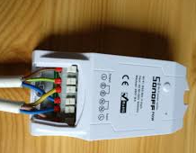
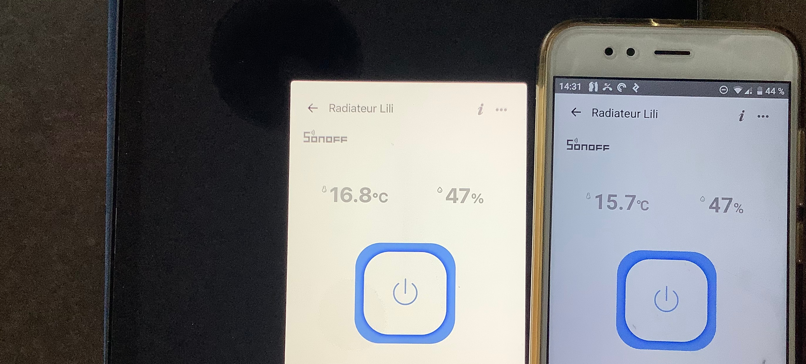
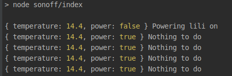

Turn on and off your heater with code. Yes, you can save money and save the planet (hem...) with a
 bit of
 Javascript.

---


Easy automation with Sonoff and Javascript
====

Sonoff
----

[Sonoff](https://amzn.to/39a54eI) is a company that builds smart and cheap components (5$ - 40$), compatible with IFTTT softwares. Some competitors of Sonoff are first [Shelly](https://amzn.to/38YKjm4), but also [Horsky](https://amzn.to/3nnwva2), Kankun.... But in terms of Javascript, I only found something similar with [Kankun](https://www.npmjs.com/package/homebridge-smartplug), but was published 3 years ago. So don't count on it.

This blogpost will present [Skydiver's ewelink npm module](https://github.com/skydiver/ewelink-api) that worked great immediately.

Because I work on the heater, I bought the [TH-16](https://amzn.to/3bcx97P) version : with a 16 Amperes capacity  with temperature sensor for 15$. Be careful to use the [Sonoff TH Sensor-AM2301](https://amzn.to/38ihMc2), other sensors are not working as well.



## eWeLink, IFTTT, Alexa...

Now it's dirty. Though your mileage may vary,  it's not working the right way for me. No way to put Alexa or similar at home. 

The ewelink app (android or iOS) is needed and allows the Internet to find your device. You create an account on eWeLink, and they will register your device. Then you have a few options to set the switch on and off. But there are a lot of limitations. Either it's controlled by a min/max temperature, either by time triggers. Given a time, it will force `on` or `off`. It's not bad but not enough, with a poor UX.

My android phone and iPad have both eWeLink installed. 



Well, you understand why I don't want to lean on the app .... Hopefully the results I get from the code are more consistent. 

IFTTT means IF This Then That. It's not an open protocol, but more a private Saas tool much like Zapier. There is an [Http API](https://platform.ifttt.com/docs/api_reference) that allows us to control the devices. It's quite hard to follow, especially on how to access the device with your rights.

## The code and the setup

The goal is to power on Lili's room, based on some constraints. If temperature is below 18 AND if
 it's the right moment of the right day, then turn it on. If not turn it off.

I just installed ewelink-api and dotenv packages, the latter to avoid hard coded passwords. There is some *closed* code about how to parse the ewelink responses.


```javascript
require('dotenv').config()
const ewelink = require('ewelink-api')

const devices = {
    lili: process.env.LILI
}

const connection = new ewelink({
    email: process.env.EMAIL,
    password: process.env.PASSWORD,
    region: process.env.REGION // eu, us ....
})

let intervalId;
connection.getDevices().then(()=> intervalId = setInterval(work, 15*60*1000))

async function work() {
    try {
        const {temperature, power} = await liliStatus()

        if (temperature < 18 && !power && timeAndDayToPowerOn()) {
            console.log({temperature, power},"Powering lili on");
            await connection.setDevicePowerState(devices.lili, 'on')
        }else{
            if(power){
                console.log({temperature, power},"Powering lili off");
                await connection.setDevicePowerState(devices.lili, 'off')
            }else{
                console.log({temperature, power},"Nothing to do");
            }
        }
    } catch (e) {
        console.error(e)
    }
}

```

That's almost all the logic needed. More details are on [this gist](https://gist.github.com/nicolas-zozol/1f06ec0822c32b5e4ce30ffaba09947a), that will probably improve this code.

## So far so good.

The device is far from the wi-fi box, but it's still working. 



Next step are to deploy this on [Clever Cloud](https://www.clever-cloud.com/en/) or similar. Maybe remove the loop from the setInterval function and run a [GCP Function](https://cloud.google.com/functions) (aka lambda) with a [cron](https://cloud.google.com/scheduler). 

Fun fact: if you keep `setInterval` in your cloud Function, you may thousands of dollars in stacked running lambdas.

The instructions are not stored on the device itself. It waits for external inputs to trigger `on
/off`. I should save money, but the problem is that heat will depend on weather and now also on
 clouds.

